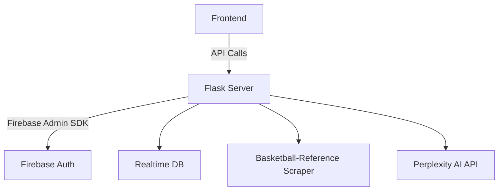

# 4Point Hoops Backend Server

This repo houses the Flask-based backend for the 4Point Hoops NBA analytics platform.

## 🔧 What It Does

- User management (signup/login via email or Google, profiles)
- Credit system to control access to AI-powered features
- Data scraping and caching from Basketball Reference
- Integration with Perplexity’s LLM for AI insights
- Admin control over users, credit requests, feedback, and system-level notifications

## 🗂 Table of Contents

- Project Overview
- Architecture
- Data Flow
- Authentication & Authorization
- Credit System
- Scraping & Caching
- AI Integration
- Setup & Installation
- API Endpoint Overview
- Error Handling
- Contributing

---

## 📌 Project Overview

The 4Point Flask server powers all backend logic behind the NBA analytics frontend:

- Fetches and cleans NBA stats from Basketball-Reference
- Serves historical + real-time data (players, teams, standings)
- Sends context-enriched prompts to Perplexity for AI-driven analysis
- Verifies users via Firebase Auth and tracks credit usage in Firebase Realtime Database
- Admins can manage credits, ban users, view feedback, and send push notifications

---

## 🧱 Architecture



- **Flask**: API server, routing, auth verification, credit logic
- **Firebase Auth**: Identity provider (email/password + Google Sign-In)
- **Firebase Realtime DB**: Stores user profiles, scraped data, chat logs, feedback, admin flags
- **BRScraper**: Pulls NBA data from Basketball-Reference
- **Perplexity AI**: LLM backend for all advanced analytics (chat, explain, projections)

---

## 🔁 Data Flow

### 1. Auth
- Frontend hits `/api/auth/signup` or `/api/auth/google-signin`
- Flask uses `firebase_admin.auth` to verify token and create user in `/users/{uid}`
- Token is returned for protected calls

### 2. Data Retrieval (Stats, Standings, Dashboard)
- POST to `/api/nba/player_stats` or `/api/nba/team_stats`
- If cached data exists in `/scraped_data`, use it
- If not, scrape via BRScraper, clean data, save to cache
- Return filtered DataFrame

### 3. AI Features
- POST to `/api/nba/perplexity_explain` or `/api/nba/perplexity_chat`
- Credit is checked and deducted before prompt is built
- Prompt sent to Perplexity's sonar-pro model
- Response is saved (explain logs or chat turns), then returned

### 4. Admin Ops
- Admin-only endpoints like `/api/admin/update_credits`, `/api/admin/feedback`
- `verify_admin()` middleware checks token and `/users/{uid}/is_admin`
- Valid admin users can perform elevated actions

---

## 🔐 Auth & Role Logic

- Firebase Auth handles identity; short-lived ID tokens are passed in headers
- All protected endpoints require `Authorization: Bearer <token>`
- `verify_token()` parses token and confirms UID
- Admin logic relies on `is_admin: true` flag in Firebase
- Credit-based endpoints use `credit_required()` to check:
  - Token
  - Suspension status
  - Credit balance
  - Auto-deduct if valid

---

## 💳 Credit System

- New users start with a default credit balance (e.g., 10)
- AI calls deduct 1 credit per use
- Users can request more credits at `/api/user/request-credits`
- Admins approve, deny, or manually update credits
- Suspended users can't access credit-based features

---

## 🧽 Scraping & Caching

- `BRScraper` pulls:
  - Player per-game & playoff stats
  - Team standings
  - Awards predictions
  - Dashboard data (MVP, playoff odds, etc.)
- All cleaned and stored in Firebase Realtime DB:
  - `/scraped_data/players`, `/scraped_data/standings`, etc.
- Cached data is reused unless stale:
  - 12h → standings
  - 24h → dashboard, player index

---

## 🤖 AI Integration

- Perplexity’s sonar-pro model is used for:
  - **AI Explain**: Inline breakdowns of stats
  - **AI Chat**: Free-form basketball convos
  - **Projections**: Long-term player potential
  - **Similar Players**: Comparison logic
  - **Award Predictions**: MVP, DPOY, ROTY, etc.
- Prompts are role-specific (`"You are a roster-building expert AI..."`)
- Chat and explain logs are saved in Firebase:
  - `/users/{uid}/chat_history`
  - `/user_analyses/{uid}`

---

## 🚀 Setup & Installation

### Prerequisites

- Python 3.8+
- pip
- Firebase Project (with Auth + Realtime DB)
- Perplexity API Key

### Firebase Setup

1. Create project via Firebase Console
2. Enable:
   - Email/Password sign-in
   - Google sign-in
   - Realtime Database
3. Add database rules (dev: full read/write)
4. Generate a Service Account key (JSON file)
5. From project settings, grab:
   - Database URL
   - Storage Bucket (if needed)

### Environment Variables

Create a `.env` file:

```env
# Firebase Admin JSON (escaped properly or passed directly in your cloud platform)
FIREBASE='{...}'

# Realtime DB base URL
DATABASE_URL=https://your-project-id-default-rtdb.firebaseio.com

# Perplexity API Key
PERPLEXITY_API_KEY=sk-xxxxxxxx
```

---

## 📡 Running Locally

```bash
pip install -r requirements.txt
python app.py
```

---

## 🧪 API Endpoints

| Route                          | Method | Auth | Description                     |
|--------------------------------|--------|------|---------------------------------|
| `/api/auth/signup`            | POST   | ❌   | Email/password registration     |
| `/api/auth/google-signin`     | POST   | ❌   | Google Sign-In flow             |
| `/api/nba/player_stats`       | POST   | ✅   | Get player stats                |
| `/api/nba/team_stats`         | POST   | ✅   | Get team stats                  |
| `/api/nba/perplexity_explain` | POST   | ✅   | LLM-driven explanation          |
| `/api/nba/perplexity_chat`    | POST   | ✅   | Conversational chat             |
| `/api/user/request-credits`   | POST   | ✅   | Request more credits            |
| `/api/admin/update_credits`   | POST   | ✅*  | Admin update user credits       |
| `/api/admin/feedback`         | GET    | ✅*  | Admin view feedback logs        |

✅ = Requires valid Firebase ID token  
✅* = Requires admin privileges

---

## ❗ Error Handling

Errors are returned in JSON:

```json
{
  "success": false,
  "message": "Insufficient credits"
}
```

Common error cases:

- Invalid or missing token
- Unauthorized admin access
- Not enough credits
- Invalid payloads

---
